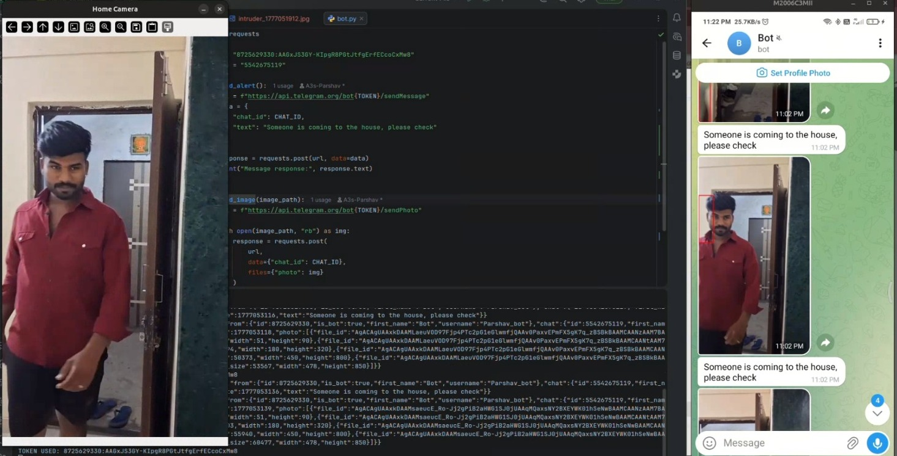
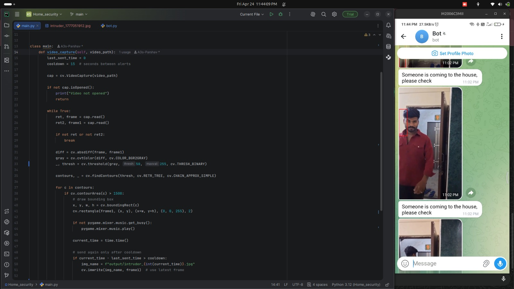

# 🏠 Home Security System (Computer Vision)

A simple AI-based home security system built using Python and OpenCV that detects motion, triggers an alert, captures images, and notifies the user.

---

## Features

- Motion / Object Detection using OpenCV  
- Alarm sound on detection  
- Captures image of detected activity  
- Sends real-time alert message with image   

---

## Tech Stack

- Python  
- OpenCV  
- Pygame  
- Requests (for alert system)

---

## Demo

> Add your screenshots here





---

## How It Works

1. Captures video input  
2. Compares frames to detect motion  
3. If motion detected:
   - Plays alert sound  
   - Captures image  
   - Sends alert to user  

---

## Installation

```bash
git clone https://github.com/YOUR-USERNAME/YOUR-REPO
cd YOUR-REPO
pip install -r requirements.txt
